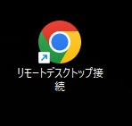
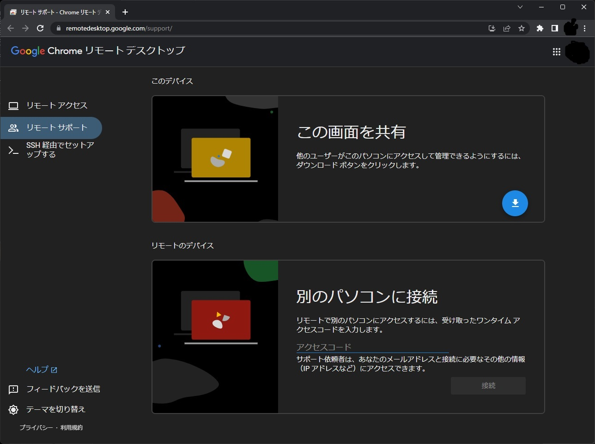
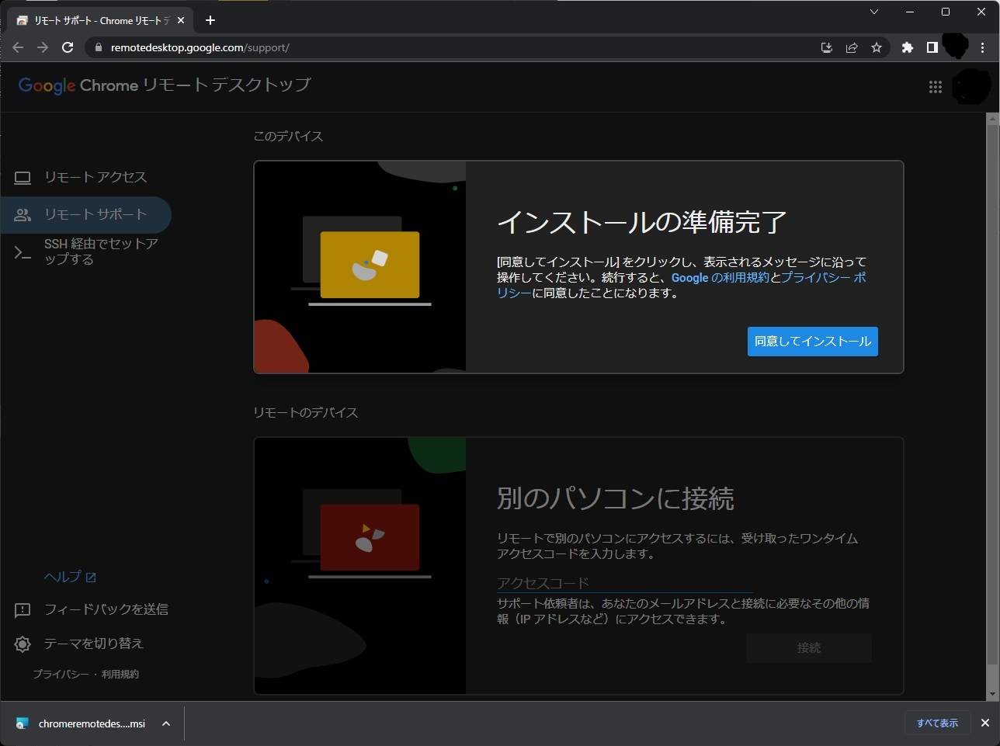
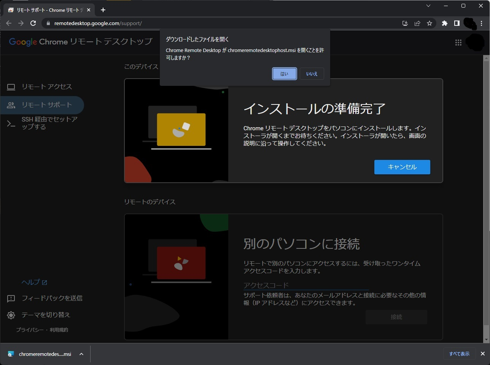
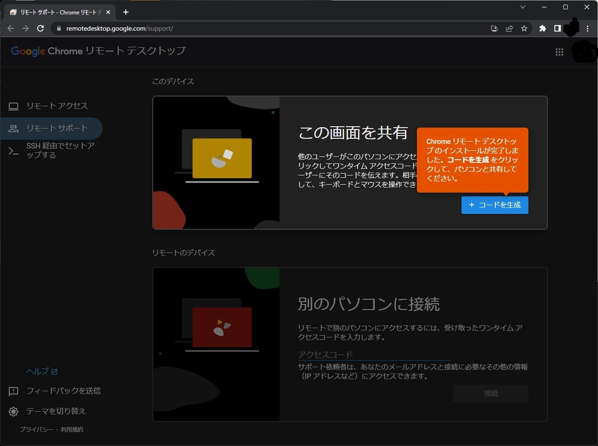

Chrome_RDC_Setup
---
遠隔地にいる人を助けるためChrome拡張のリモートデスクトップ接続をインストールするbatファイル。

### 使い方  
1. zipで固めて何らかの方法で送る。  
2. 解答してもらう。  
3. `00_all_in_one.bat`をクリックしてもらう。  
4. [Chrome Remove Desktop Support](https://remotedesktop.google.com/support/)へアクセスしてもらいピンコードを教えてもらう。  
5. 遠隔地からサポート開始。  

### 使い方2
1. デスクトップに作成されたショートカットをクリック  
  

1. 表示された画面のうちこの画面を共有の「下矢印」をクリック   
  

1. 「同意してインストール」が表示されるのでそれをクリック   
  

1. 「はい」をクリック   
  

1. 「コードを生成」をクリック   
  

1. 12桁の数字を相手に伝える。   
  

### 注意
- 拡張機能のアンインストール方法  
    PSBrowserExtensionsは管理者権限で拡張機能をインストールするので、通常のインストールと違いブラウザの画面からは削除できない。  
    削除するにはスクリプトで追加されたレジストリを削除する必要がある。  
    `regedit(レジストリエディタ)`で`コンピューター\HKEY_CURRENT_USER\SOFTWARE\Policies\Google\Chrome\ExtensionInstallForcelist`を確認し該当するレジストリ（ChromeStoreのIDで判断可能）を削除する。  
    削除後にChromeを再起動すると拡張機能アンインストールされる。  
    （Chromeは起動時に毎回レジストリを確認して拡張機能を更新する）
    `ExtensionInstallForcelist`のフォルダが残っていると組織に管理されている表示が残るので、それが好ましくない場合はフォルダごと削除する必要あり。    

### Links  
- [Chrome Remote Desktop](https://chrome.google.com/webstore/detail/chrome-remote-desktop/inomeogfingihgjfjlpeplalcfajhgai)  
- [PSBrowserExtensions](https://bitbucket.org/svalding/psbrowserextensions/src/master/)  
- [Alternative Extension Distribution Options](https://developer.chrome.com/extensions/external_extensions#registry)  
- [Updating and uninstalling](https://developer.chrome.com/extensions/external_extensions#updating)  
- [Powershellを楽に実行してもらうには](https://qiita.com/tomoko523/items/df8e384d32a377381ef9#コマンドプロンプト編)  
- [how-to-create-a-batch-file-to-run-cmd-as-administrator](https://stackoverflow.com/a/29026783)  
- [Install Chrome in Windows Server using Powershell](https://www.snel.com/support/install-chrome-in-windows-server/)  
- [起動オプション付きショートカットを作成するバッチファイル](https://qiita.com/geokih/items/326085b00e806a27c6b8)
- [ショートカットを作成するバッチファイル(ファイル単体, JScript混在)](https://qiita.com/y-takano/items/b94312abc17159dce8be)
